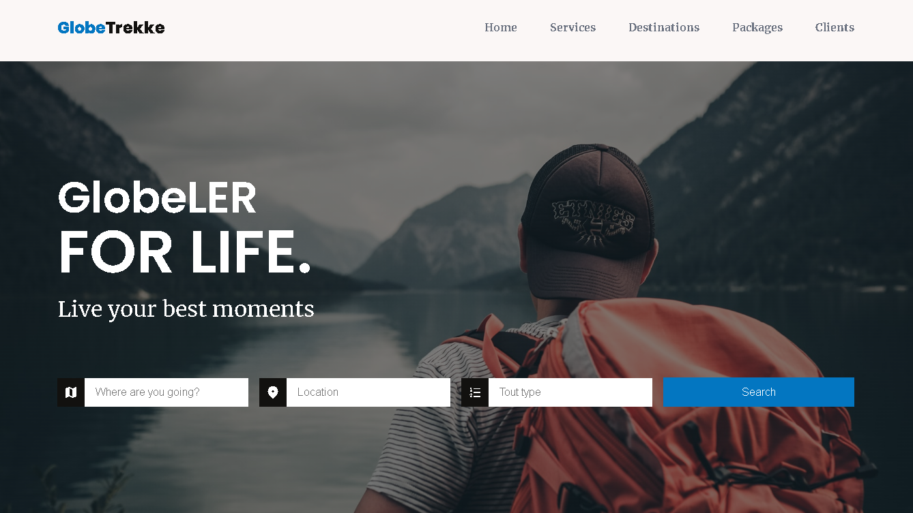
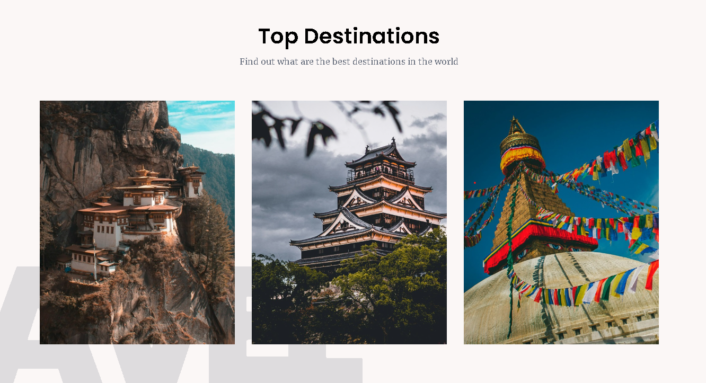
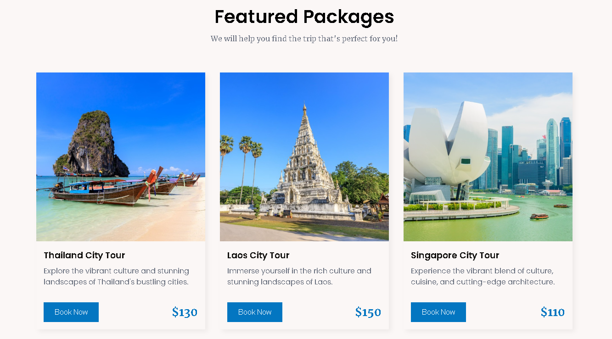
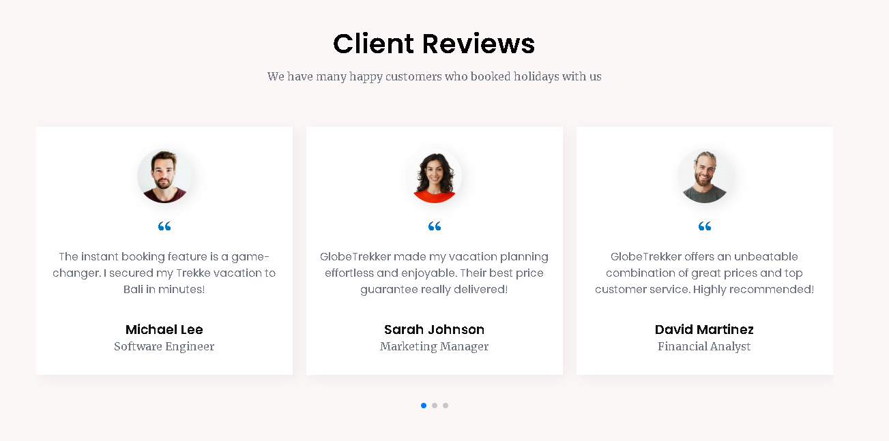

# 🌍 GlobeTrekker - Responsive Travel & Tour Website



## 📌 Overview
**GlobeTrekker** هو موقع حديث ومتجاوب لوكالات السفر والسياحة، مبني باستخدام **HTML, CSS, و JavaScript**. يقدم تجربة مستخدم سلسة لاستكشاف الوجهات السياحية، حجز الجولات، والتفاعل مع خدمات السفر بسهولة.

## 🚀 Features
- 🔹 **تصميم متجاوب بالكامل** - يعمل بسلاسة على جميع الأجهزة.
- 🔹 **صفحة رئيسية جذابة** مع صور عالية الجودة ورسوم متحركة.
- 🔹 **صفحات الوجهات السياحية** مع تفاصيل شاملة.
- 🔹 **نموذج حجز متقدم** يسمح للمستخدمين بحجز الرحلات بسهولة.
- 🔹 **تأثيرات تفاعلية باستخدام JavaScript** لتحسين تجربة المستخدم.
- 🔹 **شريط تنقل ديناميكي** يدعم التمرير الناعم (Smooth Scrolling).
- 🔹 **قسم مراجعات العملاء** يعرض تجارب السياح مع الوكالة.
- 🔹 **أداء عالي وتحميل سريع** مع تحسينات للصور والكود.

## 📸 Screenshots
### 🏠 الصفحة الرئيسية


### 📍 صفحة الوجهات السياحية


### 📅 نموذج الحجز


## 🛠️ Technologies Used
- **HTML5** - الهيكل العام للموقع
- **CSS3** - التصميم والتنسيق (Flexbox & Grid)
- **JavaScript (ES6)** - التفاعلات والرسوم المتحركة

## 📥 Installation & Usage
### 💻 تشغيل المشروع محليًا
1. قم بتنزيل المشروع أو استنسخه باستخدام Git:
   ```bash
   git clone https://github.com/username/GlobeTrekker.git
   ```
2. انتقل إلى مجلد المشروع:
   ```bash
   cd GlobeTrekker
   ```
3. افتح ملف **index.html** في المتصفح.

### 🌐 تشغيل المشروع على سيرفر محلي
إذا كنت ترغب في تشغيل الموقع باستخدام سيرفر محلي مثل Live Server:
```bash
npx live-server
```

## 🎨 Customization
إذا كنت ترغب في تخصيص الموقع:
- **الألوان والخطوط:** عدّل ملف `styles.css`.
- **المحتوى والصور:** استبدل النصوص والصور في ملفات HTML و`assets/images`.
- **إضافة ميزات جديدة:** يمكنك تحسين تجربة المستخدم عبر `script.js`.

## 🤝 Contribution
هل لديك أفكار جديدة؟ قم بإنشاء **Pull Request** أو افتح **Issue** على GitHub!

## 📜 License
هذا المشروع متاح تحت **MIT License**.

## 📧 Contact
💬 إذا كان لديك أي استفسار، لا تتردد في التواصل معي عبر:
🌎 **Website:** [yourwebsite.com](https://lechehebdjaafar.github.io/GlobeTrekker/)  
🐦 **Linkdine:** [@Lecheheb Djaafar](https://www.linkedin.com/in/lecheheb-djaafar-226594348/)

---
🚀 استمتع برحلتك مع **GlobeTrekker**! 🌍✈️
